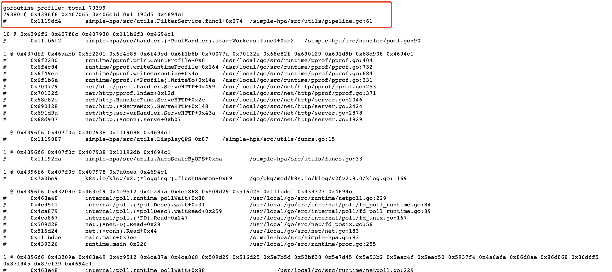
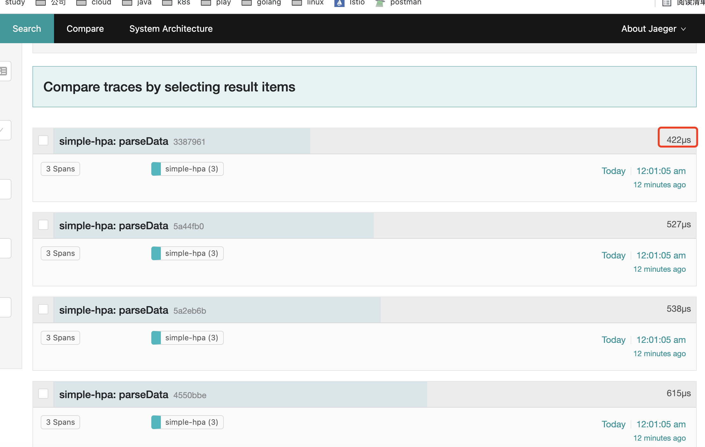

在上面的章节我们讲了如何在go的代码中发现内存和cpu的使用情况, 这个章节主要是讲一个具体的例子,通过这个例子我们怎么来找到我们代码中的问题 , 然后我们怎么去解决的。

首先我们来看一下现象, 以下图片是我查询prometheus返回的图片, 以下是promql 语句, 意思就是查询 6h小时内 simple 这个服务内存使用情况,
我们从图中很明显看出来这个服务的内存一直在增加。在内存增加的过程中我们可以看到有一些波谷的情况, 这是由于go的垃圾回收机制在起作用，但是 回收的真是杯水车薪。主要的趋势还是在增加的。在10-11 点的时候我中断请求,
内存有显著的下降但是也有很多没有回收, 从这个图我们可以明显得出结论, 当前这个服务存在内存泄漏。

```prom
container_memory_usage_bytes{container="simple"}
```


当我们定位出了内存泄漏, 接下来我们怎么来定位代码中哪个地方内存泄漏了呢？ 接下来我们需要使用pprof来定位具体的原因,在上一个章节我们已经讲过如果使用 pprof 这里我就不在多余的赘述这个问题。 接下来我们具体看现象,
在图中我们看到了一处异常的情况。当前服务使用了79399次gorouting。我不确定这个是不是引起内存泄漏的根本原因,但是出现这个问题 对于服务也是很严重的。我们首先看看为什么会产生这么多的gorouting吧。



接下来我们来看看具体是哪个代码导致的。在下图中我们可以看到是由于pipeline.go 61行导致的。 我们来看看代码吧。



```go
func FilterService(itemChan <-chan ingress.Access, services []string) <-chan ingress.Access {
channel := make(chan ingress.Access)
go func () {
defer close(channel)
data := <-itemChan
if data == nil {
return
}
for _, service := range services {
if data.ServiceName() == service {
// 主要是由于这行死锁导致这么多gorouting的
channel <- data
}
}
}()
return channel
}

```

看到这里我们已经知道是什么原因了？ 我们在这里先了解以下channel会产生死锁的因素。

### 例一:

如果a为空时 那么b := <-a这个地方会一直死锁。

```go


func cc() {
    a := make(chan int)
    go func() {
        time.Sleep(1 * time.Second)
        a <- 1
        close(a)
    }()
    fmt.Println("sleep !!!")
    time.Sleep(3 * time.Second)
    a = nil
    b := <-a
    fmt.Printf("b :%d \n", b)
    fmt.Println("complete !!!")
}


```

### 例二:


当我们新建一个size 为0 的channel 时, 这个时候当前channel 的缓冲区为0, 如果没有消费者的时候也会造成死锁的情况。

```go

func cc1() {
	a := make(chan int)
	mu := sync.WaitGroup{}
	mu.Add(2)
	go func() {
		defer close(a)
		time.Sleep(10 * time.Second)
		a <- 1
		mu.Done()
	}()
	go func() {
		ticker := time.NewTicker(1 * time.Second)
		select {
		case cc := <-a:
			fmt.Println("xx", cc)
		case <-ticker.C:
			fmt.Println("ticker")
		}
		mu.Done()
	}()
	mu.Wait()
	fmt.Println("complete !!!")
}

```


### 分析

从上面俩个例子看应该是第二种 没有消费者导致这个死锁的产生。因为在放入这个channel 中上面的代码已经判断这个data是否为空。
所以我们往后看。data就是消费这个channel的, 我们可以看到这个地方只有一个select，所以这个地方 要么就走了这个data,要么就
走进了这个tick 定时器。这个定时器的时长是12s, 所以就是这个时长超过了12s 导致了走了定时器, 消费者没了。到了这个地方似乎是明确了
问题的所在。但是这个也是一个猜测，这个时候我们就使用了opentracing在代码中埋点。

```go

func CalculateQPS(data <-chan ingress.Access, timeTick <-chan time.Time,
	qpsRecord map[string]*metrics.Calculate) <-chan *serviceInfo {
	channel := make(chan *serviceInfo)
	go func() {
		defer close(channel)
		select {
		case item := <-data:
			if item == nil {
				return
			}
			if record, exist := qpsRecord[item.ServiceName()]; exist {
				record.Update(item.Upstream(), item.AccessTime())
			} else {
				qpsRecord[item.ServiceName()] = metrics.NewCalculate(item.Upstream(), item.AccessTime())
			}
		case <-timeTick:
			for service, calculate := range qpsRecord {
				channel <- &serviceInfo{Name: service, AvgQps: calculate.AvgQps(), PodCount: calculate.GetPodCount()}
			}
		}
	}()
	return channel
}

```


当我看到这个消费能力很不错都控制在12us以内, 所以我猜想的这个想法是所务的。


改了这个问题后服务的内存恢复了正常, 这个时候我们需要回顾一下, 为什么那么多的gorouting 会产生内存 很高的情况，cpu 基本没有什么变化。
那么下一讲我们来介绍死锁会导致内存高 还是cpu高还是都高呢？