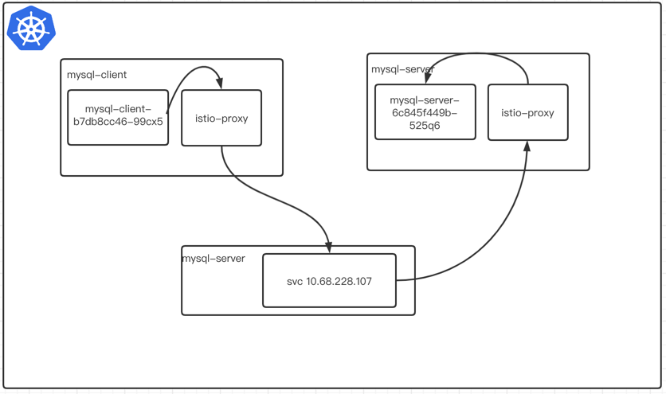
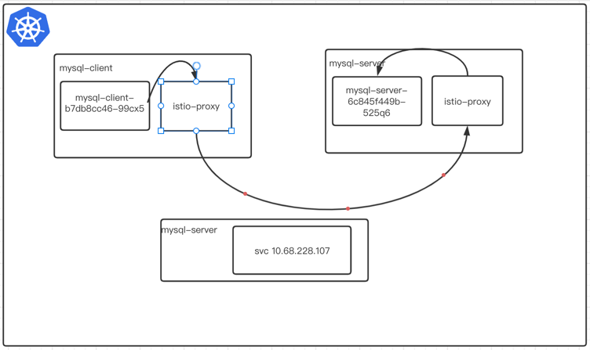

前几天在客户环境出现了一个非常奇怪的问题, 集群内部环境无法访问集群外部的mysql, 好像redis也有类似的问题, 当时k8s版本1.11 istio 1.4,
istio和k8s 版本都比较低。后面 用istio1.6 貌似也有同样的问题。

首先我们在集群内访问试一下

mysql-client ----> mysql-server 

```bash
$ kubectl apply -f mysql-server.yaml

$ kubectl apply -f mysql-client.yaml

```

查看pod状态并注入sidecar

```bash

$ kubectl get po
 
NAME                            READY   STATUS    RESTARTS   AGE
mysql-client-b7db8cc46-99cx5    2/2     Running   0          81s
mysql-server-6c845f449b-525q6   2/2     Running   0          81s
```


当我们注入sidecar 之后我们测试一下 client端能否访问的server mysql, 可以看到是可以正常访问mysql-server 的，我们现在看看其中到底发生了谢什么

```bash

$ kubectl exec -it mysql-client-b7db8cc46-99cx5 telnet mysql-server 3306
kubectl exec [POD] [COMMAND] is DEPRECATED and will be removed in a future version. Use kubectl exec [POD] -- [COMMAND] instead.
Defaulted container "mysql" out of: mysql, istio-proxy, istio-init (init)
Connected to mysql-server
J
8.0.26	*F?eZTM\�~h#DD#2)caching_sha2_password
```


我们首先查看mysql-client 这个pod 出口的listener(监听器), 从下面的返回的监听器我们可以看出3306 端口只有一个mysql-server.demo1.svc.cluster.local
的监听器, 然后我们看看这个监听器的cluster是什么？

```bash
➜  ~ istioctl  pc listener mysql-client-b7db8cc46-99cx5 --port 3306
ADDRESS       PORT MATCH DESTINATION
10.68.228.107 3306 ALL   Cluster: outbound|3306||mysql-server.demo1.svc.cluster.local

```

因为监听器的打印太多了 我就截了一小段, 可以看到3306出口cluster 为`outbound|3306||mysql-server.demo1.svc.cluster.local`

```json

                    {
                        "name": "envoy.filters.network.tcp_proxy",
                        "typedConfig": {
                            "@type": "type.googleapis.com/envoy.extensions.filters.network.tcp_proxy.v3.TcpProxy",
                            "statPrefix": "outbound|3306||mysql-server.demo1.svc.cluster.local",
                            "cluster": "outbound|3306||mysql-server.demo1.svc.cluster.local",
                            "accessLog": [
                                {
                                    "name": "envoy.access_loggers.file",
                                    "typedConfig": {
                                        "@type": "type.googleapis.com/envoy.extensions.access_loggers.file.v3.FileAccessLog",
                                        "path": "/dev/stdout",
                                        "logFormat": {
                                            "textFormat": "[%START_TIME%] \"%REQ(:METHOD)% %REQ(X-ENVOY-ORIGINAL-PATH?:PATH)% %PROTOCOL%\" %RESPONSE_CODE% %RESPONSE_FLAGS% %RESPONSE_CODE_DETAILS% %CONNECTION_TERMINATION_DETAILS% \"%UPSTREAM_TRANSPORT_FAILURE_REASON%\" %BYTES_RECEIVED% %BYTES_SENT% %DURATION% %RESP(X-ENVOY-UPSTREAM-SERVICE-TIME)% \"%REQ(X-FORWARDED-FOR)%\" \"%REQ(USER-AGENT)%\" \"%REQ(X-REQUEST-ID)%\" \"%REQ(:AUTHORITY)%\" \"%UPSTREAM_HOST%\" %UPSTREAM_CLUSTER% %UPSTREAM_LOCAL_ADDRESS% %DOWNSTREAM_LOCAL_ADDRESS% %DOWNSTREAM_REMOTE_ADDRESS% %REQUESTED_SERVER_NAME% %ROUTE_NAME%\n"
                                        }
                                    }
                                }
                            ]
                        }
                    }

```


接下来我们查询当前pod的cluster

```bash
$ stioctl pc cluster mysql-client-b7db8cc46-99cx5 --fqdn "outbound|3306||mysql-server.demo1.svc.cluster.local" -o json
[
    {
        "transportSocketMatches": [
            {
                "name": "tlsMode-istio",
                "match": {
                    "tlsMode": "istio"
                },
                "transportSocket": {
                    "name": "envoy.transport_sockets.tls",
                    "typedConfig": {
                        "@type": "type.googleapis.com/envoy.extensions.transport_sockets.tls.v3.UpstreamTlsContext",
                        "commonTlsContext": {
                            "tlsCertificateSdsSecretConfigs": [
                                {
                                    "name": "default",
                                    "sdsConfig": {
                                        "apiConfigSource": {
                                            "apiType": "GRPC",
                                            "transportApiVersion": "V3",
                                            "grpcServices": [
                                                {
                                                    "envoyGrpc": {
                                                        "clusterName": "sds-grpc"
                                                    }
                                                }
                                            ],
                                            "setNodeOnFirstMessageOnly": true
                                        },
                                        "initialFetchTimeout": "0s",
                                        "resourceApiVersion": "V3"
                                    }
                                }
                            ],
                            "combinedValidationContext": {
                                "defaultValidationContext": {
                                    "matchSubjectAltNames": [
                                        {
                                            "exact": "spiffe://cluster.local/ns/demo1/sa/default"
                                        }
                                    ]
                                },
                                "validationContextSdsSecretConfig": {
                                    "name": "ROOTCA",
                                    "sdsConfig": {
                                        "apiConfigSource": {
                                            "apiType": "GRPC",
                                            "transportApiVersion": "V3",
                                            "grpcServices": [
                                                {
                                                    "envoyGrpc": {
                                                        "clusterName": "sds-grpc"
                                                    }
                                                }
                                            ],
                                            "setNodeOnFirstMessageOnly": true
                                        },
                                        "initialFetchTimeout": "0s",
                                        "resourceApiVersion": "V3"
                                    }
                                }
                            },
                            "alpnProtocols": [
                                "istio-peer-exchange",
                                "istio"
                            ]
                        },
                        "sni": "outbound_.3306_._.mysql-server.demo1.svc.cluster.local"
                    }
                }
            },
            {
                "name": "tlsMode-disabled",
                "match": {},
                "transportSocket": {
                    "name": "envoy.transport_sockets.raw_buffer"
                }
            }
        ],
        "name": "outbound|3306||mysql-server.demo1.svc.cluster.local",
        "type": "EDS",
        "edsClusterConfig": {
            "edsConfig": {
                "ads": {},
                "resourceApiVersion": "V3"
            },
            "serviceName": "outbound|3306||mysql-server.demo1.svc.cluster.local"
        },
        "connectTimeout": "10s",
        "circuitBreakers": {
            "thresholds": [
                {
                    "maxConnections": 4294967295,
                    "maxPendingRequests": 4294967295,
                    "maxRequests": 4294967295,
                    "maxRetries": 4294967295
                }
            ]
        },
        "metadata": {
            "filterMetadata": {
                "istio": {
                    "default_original_port": 3306,
                    "services": [
                        {
                            "host": "mysql-server.demo1.svc.cluster.local",
                            "name": "mysql-server",
                            "namespace": "demo1"
                        }
                    ]
                }
            }
        },
        "filters": [
            {
                "name": "istio.metadata_exchange",
                "typedConfig": {
                    "@type": "type.googleapis.com/udpa.type.v1.TypedStruct",
                    "typeUrl": "type.googleapis.com/envoy.tcp.metadataexchange.config.MetadataExchange",
                    "value": {
                        "protocol": "istio-peer-exchange"
                    }
                }
            }
        ]
    }
]
```

我们从cluster的配置我们知道

使用EDS来找到destination 的pod, Envoy 将查找名为的服务的列表 `outbound|3306||mysql-server.demo1.svc.cluster.local`

下面我们看看envoy 中endpoint `outbound|3306||mysql-server.demo1.svc.cluster.local` 列表, 然后我们查询了mysql-server 的pod ip
--> `172.20.0.30` 看起来没有任何问题。所以我们从这个地方可以得出一个结论。


我当时认为流量是这么路由的 但是通过我们对ep的查看流量是没有经过svc地址的 直接访问当前服务的`endpoint`地址



此时是这个样子的





```bash
➜  ~  istioctl pc ep mysql-client-b7db8cc46-99cx5 --port 3306
ENDPOINT             STATUS      OUTLIER CHECK     CLUSTER
172.20.0.30:3306     HEALTHY     OK                outbound|3306||mysql-server.demo1.svc.cluster.local

➜  ~ k get po -o wide
NAME                            READY   STATUS    RESTARTS   AGE   IP            NODE           NOMINATED NODE   READINESS GATES
mysql-client-b7db8cc46-99cx5    2/2     Running   0          33m   172.20.0.31   10.10.13.118   <none>           <none>
mysql-server-6c845f449b-525q6   2/2     Running   0          33m   172.20.0.30   10.10.13.118   <none>           <none>
```

集群里面的流量是正常的,现在我们在集群外面部署一个mysql 从集群内部pod(mysql-client-b7db8cc46-99cx5)访问集群外部的mysql, 
此时我们看看能不能正常访问当前的mysql-server, 此时也可以访问的 这个时候我们在来看看listener

```bash
$ ~ kubectl exec -it mysql-client-b7db8cc46-99cx5 telnet 10.10.13.110 3306
kubectl exec [POD] [COMMAND] is DEPRECATED and will be removed in a future version. Use kubectl exec [POD] -- [COMMAND] instead.
Defaulted container "mysql" out of: mysql, istio-proxy, istio-init (init)
Connected to 10.10.13.110
J
8.0.26\r(Juh�5kguvqI2"}!caching_sha2_password
```

我们现在在任意的命名空间创建一个serviceentry, 这个时候我们在来看发生来什么变化，我们不能正常访问集群外部的流量了, 我们看看这个流量到哪里去了
```bash
➜  ~ kubectl exec -it mysql-client-b7db8cc46-99cx5 telnet 10.10.13.110 3306
kubectl exec [POD] [COMMAND] is DEPRECATED and will be removed in a future version. Use kubectl exec [POD] -- [COMMAND] instead.
Defaulted container "mysql" out of: mysql, istio-proxy, istio-init (init)
Connected to 10.10.13.110
Connection closed by foreign host
command terminated with exit code 1
```

我们获取client 的listener, 我们发现多了一个`0.0.0.0` 的监听器, 这个是我在别的ns下创建了一个se导致的,
默认在所有监听器都匹配不上的时候就会默认去访问这个`0.0.0.0`的listener 

```bash
➜  ~ istioctl pc listener mysql-client-b7db8cc46-99cx5 --port 3306
ADDRESS       PORT MATCH DESTINATION
0.0.0.0       3306 ALL   Cluster: outbound|3306||mysql.demo
10.68.228.107 3306 ALL   Cluster: outbound|3306||mysql-server.demo1.svc.cluster.local
```

接下来我们来看看cluster是什么, 默认访问的是`outbound|3306||mysql.demo`, 这个地址指向到一个空的svc上面, 所以我们访问不了外部的svc地址

```json
➜  ~ istioctl pc listener mysql-client-b7db8cc46-99cx5 --port 3306 -o json
        
{
                        "name": "envoy.filters.network.tcp_proxy",
                        "typedConfig": {
                            "@type": "type.googleapis.com/envoy.extensions.filters.network.tcp_proxy.v3.TcpProxy",
                            "statPrefix": "outbound|3306||mysql.demo",
                            "cluster": "outbound|3306||mysql.demo",
                            "accessLog": [
                                {
                                    "name": "envoy.access_loggers.file",
                                    "typedConfig": {
                                        "@type": "type.googleapis.com/envoy.extensions.access_loggers.file.v3.FileAccessLog",
                                        "path": "/dev/stdout",
                                        "logFormat": {
                                            "textFormat": "[%START_TIME%] \"%REQ(:METHOD)% %REQ(X-ENVOY-ORIGINAL-PATH?:PATH)% %PROTOCOL%\" %RESPONSE_CODE% %RESPONSE_FLAGS% %RESPONSE_CODE_DETAILS% %CONNECTION_TERMINATION_DETAILS% \"%UPSTREAM_TRANSPORT_FAILURE_REASON%\" %BYTES_RECEIVED% %BYTES_SENT% %DURATION% %RESP(X-ENVOY-UPSTREAM-SERVICE-TIME)% \"%REQ(X-FORWARDED-FOR)%\" \"%REQ(USER-AGENT)%\" \"%REQ(X-REQUEST-ID)%\" \"%REQ(:AUTHORITY)%\" \"%UPSTREAM_HOST%\" %UPSTREAM_CLUSTER% %UPSTREAM_LOCAL_ADDRESS% %DOWNSTREAM_LOCAL_ADDRESS% %DOWNSTREAM_REMOTE_ADDRESS% %REQUESTED_SERVER_NAME% %ROUTE_NAME%\n"
                                        }
                                    }
```


### 解决方案