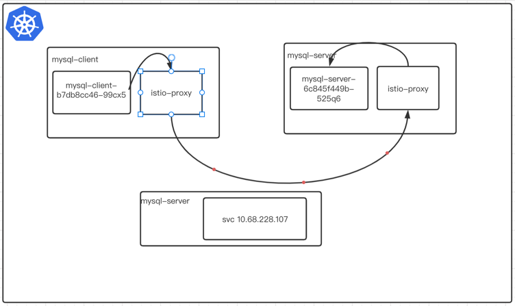

## 前言

前几天在生产环境出现了一个非常奇怪的问题, 集群内部环境无法访问集群外部的mysql, 好像redis也有类似的问题, 当时k8s版本1.11 istio 1.4,
istio和k8s 版本都比较低。后面 用istio1.6 貌似也有同样的问题。

## 使用集群内部的mysql

首先我们在集群内访问试一下, 我使用一个mysql的client 端和server 来模拟这种情况

mysql-client ----> mysql-server

```bash
$ kubectl apply -f - <<EOF
apiVersion: apps/v1
kind: Deployment
metadata:
  generation: 2
  labels:
    app: mysql-server
  name: mysql-server
  namespace: demo1
spec:
  progressDeadlineSeconds: 600
  replicas: 1
  revisionHistoryLimit: 10
  selector:
    matchLabels:
      app: mysql-server
  strategy:
    rollingUpdate:
      maxSurge: 25%
      maxUnavailable: 25%
    type: RollingUpdate
  template:
    metadata:
      creationTimestamp: null
      labels:
        app: mysql-server
    spec:
      containers:
        - env:
            - name: MYSQL_ROOT_PASSWORD
              value: password
          image: mysql
          imagePullPolicy: Always
          name: mysql
          ports:
            - containerPort: 3306
              protocol: TCP
          resources: {}
          terminationMessagePath: /dev/termination-log
          terminationMessagePolicy: File
      dnsPolicy: ClusterFirst
      restartPolicy: Always
      schedulerName: default-scheduler
      securityContext: {}
      terminationGracePeriodSeconds: 30
---

apiVersion: v1
kind: Service
metadata:
  labels:
    app: mysql-server
  name: mysql-server
  namespace: demo1
spec:
  clusterIP: 10.68.228.107
  externalTrafficPolicy: Cluster
  ports:
    - name: 3306-3306
      nodePort: 32011
      port: 3306
      protocol: TCP
      targetPort: 3306
  selector:
    app: mysql-server
  sessionAffinity: None
  type: NodePort
EOF  

$ kubectl apply -f - <<EOF
apiVersion: apps/v1
kind: Deployment
metadata:
  generation: 2
  labels:
    app: mysql-client
  name: mysql-client
  namespace: demo1
spec:
  progressDeadlineSeconds: 600
  replicas: 1
  revisionHistoryLimit: 10
  selector:
    matchLabels:
      app: mysql-client
  strategy:
    rollingUpdate:
      maxSurge: 25%
      maxUnavailable: 25%
    type: RollingUpdate
  template:
    metadata:
      creationTimestamp: null
      labels:
        app: mysql-client
    spec:
      containers:
        - image: clarechu/mysql-client:v1
          imagePullPolicy: Always
          name: mysql
          resources: {}
          terminationMessagePath: /dev/termination-log
          terminationMessagePolicy: File
      dnsPolicy: ClusterFirst
      restartPolicy: Always
      schedulerName: default-scheduler
      securityContext: {}
      terminationGracePeriodSeconds: 30
EOF

```

查看pod状态并注入sidecar

```bash

$ kubectl get po
 
NAME                            READY   STATUS    RESTARTS   AGE
mysql-client-b7db8cc46-99cx5    2/2     Running   0          81s
mysql-server-6c845f449b-525q6   2/2     Running   0          81s
```

当我们注入sidecar 之后我们测试一下 client端能否访问的server mysql, 可以看到是可以正常访问mysql-server 的,我们现在看看其中到底发生了什么？ 在同一个ns下是可以正常的访问mysql-server的。

```bash

$ kubectl exec -it mysql-client-b7db8cc46-99cx5 telnet mysql-server 3306
kubectl exec [POD] [COMMAND] is DEPRECATED and will be removed in a future version. Use kubectl exec [POD] -- [COMMAND] instead.
Defaulted container "mysql" out of: mysql, istio-proxy, istio-init (init)
Connected to mysql-server
J
8.0.26	*F?eZTM\�~h#DD#2)caching_sha2_password
```

我们首先查看mysql-client 这个pod 出口的listener(监听器), 从下面的返回的监听器我们可以看出3306 端口只有一个`mysql-server.demo1.svc.cluster.local`的监听器, 然后我们看看这个监听器的cluster是什么？

```bash
➜  ~ istioctl  pc listener mysql-client-b7db8cc46-99cx5 --port 3306
ADDRESS       PORT MATCH DESTINATION
10.68.228.107 3306 ALL   Cluster: outbound|3306||mysql-server.demo1.svc.cluster.local

```

因为监听器的打印太多了 我就截了一小段, 可以看到3306出口cluster 为`outbound|3306||mysql-server.demo1.svc.cluster.local`

```json

                    {
                        "name": "envoy.filters.network.tcp_proxy",
                        "typedConfig": {
                            "@type": "type.googleapis.com/envoy.extensions.filters.network.tcp_proxy.v3.TcpProxy",
                            "statPrefix": "outbound|3306||mysql-server.demo1.svc.cluster.local",
                            "cluster": "outbound|3306||mysql-server.demo1.svc.cluster.local",
                            "accessLog": [
                                {
                                    "name": "envoy.access_loggers.file",
                                    "typedConfig": {
                                        "@type": "type.googleapis.com/envoy.extensions.access_loggers.file.v3.FileAccessLog",
                                        "path": "/dev/stdout",
                                        "logFormat": {
                                            "textFormat": "[%START_TIME%] \"%REQ(:METHOD)% %REQ(X-ENVOY-ORIGINAL-PATH?:PATH)% %PROTOCOL%\" %RESPONSE_CODE% %RESPONSE_FLAGS% %RESPONSE_CODE_DETAILS% %CONNECTION_TERMINATION_DETAILS% \"%UPSTREAM_TRANSPORT_FAILURE_REASON%\" %BYTES_RECEIVED% %BYTES_SENT% %DURATION% %RESP(X-ENVOY-UPSTREAM-SERVICE-TIME)% \"%REQ(X-FORWARDED-FOR)%\" \"%REQ(USER-AGENT)%\" \"%REQ(X-REQUEST-ID)%\" \"%REQ(:AUTHORITY)%\" \"%UPSTREAM_HOST%\" %UPSTREAM_CLUSTER% %UPSTREAM_LOCAL_ADDRESS% %DOWNSTREAM_LOCAL_ADDRESS% %DOWNSTREAM_REMOTE_ADDRESS% %REQUESTED_SERVER_NAME% %ROUTE_NAME%\n"
                                        }
                                    }
                                }
                            ]
                        }
                    }

```


接下来我们查询当前pod的cluster

```bash
$ stioctl pc cluster mysql-client-b7db8cc46-99cx5 --fqdn "outbound|3306||mysql-server.demo1.svc.cluster.local" -o json
[
    {
        "transportSocketMatches": [
            {
                "name": "tlsMode-istio",
                "match": {
                    "tlsMode": "istio"
                },
                "transportSocket": {
                    "name": "envoy.transport_sockets.tls",
                    "typedConfig": {
                        "@type": "type.googleapis.com/envoy.extensions.transport_sockets.tls.v3.UpstreamTlsContext",
                        "commonTlsContext": {
                            "tlsCertificateSdsSecretConfigs": [
                                {
                                    "name": "default",
                                    "sdsConfig": {
                                        "apiConfigSource": {
                                            "apiType": "GRPC",
                                            "transportApiVersion": "V3",
                                            "grpcServices": [
                                                {
                                                    "envoyGrpc": {
                                                        "clusterName": "sds-grpc"
                                                    }
                                                }
                                            ],
                                            "setNodeOnFirstMessageOnly": true
                                        },
                                        "initialFetchTimeout": "0s",
                                        "resourceApiVersion": "V3"
                                    }
                                }
                            ],
                            "combinedValidationContext": {
                                "defaultValidationContext": {
                                    "matchSubjectAltNames": [
                                        {
                                            "exact": "spiffe://cluster.local/ns/demo1/sa/default"
                                        }
                                    ]
                                },
                                "validationContextSdsSecretConfig": {
                                    "name": "ROOTCA",
                                    "sdsConfig": {
                                        "apiConfigSource": {
                                            "apiType": "GRPC",
                                            "transportApiVersion": "V3",
                                            "grpcServices": [
                                                {
                                                    "envoyGrpc": {
                                                        "clusterName": "sds-grpc"
                                                    }
                                                }
                                            ],
                                            "setNodeOnFirstMessageOnly": true
                                        },
                                        "initialFetchTimeout": "0s",
                                        "resourceApiVersion": "V3"
                                    }
                                }
                            },
                            "alpnProtocols": [
                                "istio-peer-exchange",
                                "istio"
                            ]
                        },
                        "sni": "outbound_.3306_._.mysql-server.demo1.svc.cluster.local"
                    }
                }
            },
            {
                "name": "tlsMode-disabled",
                "match": {},
                "transportSocket": {
                    "name": "envoy.transport_sockets.raw_buffer"
                }
            }
        ],
        "name": "outbound|3306||mysql-server.demo1.svc.cluster.local",
        "type": "EDS",
        "edsClusterConfig": {
            "edsConfig": {
                "ads": {},
                "resourceApiVersion": "V3"
            },
            "serviceName": "outbound|3306||mysql-server.demo1.svc.cluster.local"
        },
        "connectTimeout": "10s",
        "circuitBreakers": {
            "thresholds": [
                {
                    "maxConnections": 4294967295,
                    "maxPendingRequests": 4294967295,
                    "maxRequests": 4294967295,
                    "maxRetries": 4294967295
                }
            ]
        },
        "metadata": {
            "filterMetadata": {
                "istio": {
                    "default_original_port": 3306,
                    "services": [
                        {
                            "host": "mysql-server.demo1.svc.cluster.local",
                            "name": "mysql-server",
                            "namespace": "demo1"
                        }
                    ]
                }
            }
        },
        "filters": [
            {
                "name": "istio.metadata_exchange",
                "typedConfig": {
                    "@type": "type.googleapis.com/udpa.type.v1.TypedStruct",
                    "typeUrl": "type.googleapis.com/envoy.tcp.metadataexchange.config.MetadataExchange",
                    "value": {
                        "protocol": "istio-peer-exchange"
                    }
                }
            }
        ]
    }
]
```

我们从cluster的配置我们知道

使用EDS来找到destination 的pod, Envoy 将查找名为的服务的列表 `outbound|3306||mysql-server.demo1.svc.cluster.local`

下面我们看看envoy 中endpoint `outbound|3306||mysql-server.demo1.svc.cluster.local` 列表,  从而找到mysql-server 的pod ip
--> `172.20.0.30` 看起来没有任何问题。所以我们从这个地方可以得出一个结论。

我当时认为流量是这么路由的 但是通过我们对ep的查看流量是没有经过svc地址的 直接访问当前服务的`endpoint`地址


此时是这个样子的, 当服务注入sidecar之后是不经过k8s 的svc的直接访问出口的pod ip。



```bash
➜  ~  istioctl pc ep mysql-client-b7db8cc46-99cx5 --port 3306
ENDPOINT             STATUS      OUTLIER CHECK     CLUSTER
172.20.0.30:3306     HEALTHY     OK                outbound|3306||mysql-server.demo1.svc.cluster.local

➜  ~ k get po -o wide
NAME                            READY   STATUS    RESTARTS   AGE   IP            NODE           NOMINATED NODE   READINESS GATES
mysql-client-b7db8cc46-99cx5    2/2     Running   0          33m   172.20.0.31   10.10.13.118   <none>           <none>
mysql-server-6c845f449b-525q6   2/2     Running   0          33m   172.20.0.30   10.10.13.118   <none>           <none>
```

## 使用集群外部mysql

集群里面的流量是正常的,现在我们在集群外面部署一个mysql 从集群内部pod(mysql-client-b7db8cc46-99cx5)访问集群外部的mysql, 此时我们看看能不能正常访问当前的mysql-server, 此时也可以访问的 这个时候我们在来看看listener

```bash
$ ~ kubectl exec -it mysql-client-b7db8cc46-99cx5 telnet 10.10.13.110 3306
kubectl exec [POD] [COMMAND] is DEPRECATED and will be removed in a future version. Use kubectl exec [POD] -- [COMMAND] instead.
Defaulted container "mysql" out of: mysql, istio-proxy, istio-init (init)
Connected to 10.10.13.110
J
8.0.26\r(Juh�5kguvqI2"}!caching_sha2_password
```

我们现在在任意的命名空间创建一个serviceentry, 这个时候我们在来看发生来什么变化,从下面的例子我们可以看出我们不能正常访问集群外部的流量了, 此时我们看看这个流量到哪里去了呢？

```bash
➜  ~ kubectl exec -it mysql-client-b7db8cc46-99cx5 telnet 10.10.13.110 3306
kubectl exec [POD] [COMMAND] is DEPRECATED and will be removed in a future version. Use kubectl exec [POD] -- [COMMAND] instead.
Defaulted container "mysql" out of: mysql, istio-proxy, istio-init (init)
Connected to 10.10.13.110
Connection closed by foreign host
command terminated with exit code 1
```

我们获取client 的listener, 我们发现多了一个`0.0.0.0` 的监听器, 这个是由于我在别的ns下创建了一个se导致的,
默认在所有监听器都匹配不上的时候就会默认去访问这个`0.0.0.0`的listener。

```bash
➜  ~ istioctl pc listener mysql-client-b7db8cc46-99cx5 --port 3306
ADDRESS       PORT MATCH DESTINATION
0.0.0.0       3306 ALL   Cluster: outbound|3306||mysql.demo
10.68.228.107 3306 ALL   Cluster: outbound|3306||mysql-server.demo1.svc.cluster.local
```

接下来我们来看看cluster是什么, 默认访问的是`outbound|3306||mysql.demo`, 这个地址指向到一个空的svc上面, 所以我们访问不了外部的svc地址

```json
➜  ~ istioctl pc listener mysql-client-b7db8cc46-99cx5 --port 3306 -o json
        
{
                        "name": "envoy.filters.network.tcp_proxy",
                        "typedConfig": {
                            "@type": "type.googleapis.com/envoy.extensions.filters.network.tcp_proxy.v3.TcpProxy",
                            "statPrefix": "outbound|3306||mysql.demo",
                            "cluster": "outbound|3306||mysql.demo",
                            "accessLog": [
                                {
                                    "name": "envoy.access_loggers.file",
                                    "typedConfig": {
                                        "@type": "type.googleapis.com/envoy.extensions.access_loggers.file.v3.FileAccessLog",
                                        "path": "/dev/stdout",
                                        "logFormat": {
                                            "textFormat": "[%START_TIME%] \"%REQ(:METHOD)% %REQ(X-ENVOY-ORIGINAL-PATH?:PATH)% %PROTOCOL%\" %RESPONSE_CODE% %RESPONSE_FLAGS% %RESPONSE_CODE_DETAILS% %CONNECTION_TERMINATION_DETAILS% \"%UPSTREAM_TRANSPORT_FAILURE_REASON%\" %BYTES_RECEIVED% %BYTES_SENT% %DURATION% %RESP(X-ENVOY-UPSTREAM-SERVICE-TIME)% \"%REQ(X-FORWARDED-FOR)%\" \"%REQ(USER-AGENT)%\" \"%REQ(X-REQUEST-ID)%\" \"%REQ(:AUTHORITY)%\" \"%UPSTREAM_HOST%\" %UPSTREAM_CLUSTER% %UPSTREAM_LOCAL_ADDRESS% %DOWNSTREAM_LOCAL_ADDRESS% %DOWNSTREAM_REMOTE_ADDRESS% %REQUESTED_SERVER_NAME% %ROUTE_NAME%\n"
                                        }
                                    }
```

在别的命名空间下创建serviceentry 会影响当前namespace 下服务。

### 解决方案

1. 使用sidecar crd资源


在我们创建serviceentry 的namespace 中写入一个sidecar的资源,该例子是在demo1的
命名空间中声明了一个全局默认配置,该配置在所有命名空间中配置sidecar以仅允许出口流量到同一命名空间中的其他工作负载以及命名空间中的服务 istio-system
```yaml
apiVersion: networking.istio.io/v1beta1
kind: Sidecar
metadata:
  name: default
  namespace: demo1
spec:
  egress:
  - hosts:
    - "./*"
    - "istio-system/*"

```

当我们创建了sidecar 资源后我们在观察mysql-client 这个pod的listener, 此时少了一个0.0.0.0 的监听器,我们在来求证一下mysql-client 是否能正常访问外部mysql服务。

```yaml
➜  ~ istioctl pc  listener mysql-client-b7db8cc46-99cx5 --port 3306
ADDRESS       PORT MATCH DESTINATION
10.68.228.107 3306 ALL   Cluster: outbound|3306||mysql-server.demo1.svc.cluster.local
10.68.66.97   3306 ALL   Cluster: outbound|3306||mysql-client.demo1.svc.cluster.local

➜  ~ kubectl exec -it mysql-client-b7db8cc46-99cx5 telnet 10.10.13.110 3306
kubectl exec [POD] [COMMAND] is DEPRECATED and will be removed in a future version. Use kubectl exec [POD] -- [COMMAND] instead.
Defaulted container "mysql" out of: mysql, istio-proxy, istio-init (init)
Connected to 10.10.13.110
J
B5>�I=6s=E6,&M}Qcaching_sha2_password

!#08S01Got packets out of orderConnection closed by foreign host
command terminated with exit code 1
```


2. 更改其他的端口

这种方式当创建了一个端口的se之后我们更改mysql的port 那么就不会匹配到0.0.0.0 3306 的端口这样就不会有这个问题。


3. 开启智能dns

在安装istio的时候开启istio 智能dns,不过这个功能是istio1.8才有的功能,如果版本偏低建议还是升级一下.

在安装istio的过程中我们需要在iop资源中添加一下以下配置

```yaml
  meshConfig:
    accessLogFile: /dev/stdout
    defaultConfig:
      proxyMetadata:
        ISTIO_META_DNS_CAPTURE: "true"
```

在创建se的时候指定address 使 mysql.demo122 这个host指向这个ip

```yaml
- apiVersion: networking.istio.io/v1beta1
  kind: ServiceEntry
  metadata:
    name: mysql
    namespace: demo
  spec:
    addresses:
    - 240.0.221.130
    hosts:
    - mysql.demo122
    location: MESH_INTERNAL
    ports:
    - name: tcp
      number: 3306
      protocol: TCP
      targetPort: 3306
    resolution: STATIC
```

当我们创建了这个serviceentry 之后我们在mysql-client中在访问这个host的时候指向这个`240.0.221.130`的虚拟ip。

```bash
➜  ~ kubectl exec -it mysql-client-b7db8cc46-99cx5 ping mysql.demo122
kubectl exec [POD] [COMMAND] is DEPRECATED and will be removed in a future version. Use kubectl exec [POD] -- [COMMAND] instead.
Defaulted container "mysql" out of: mysql, istio-proxy, istio-init (init)
PING mysql.demo122 (240.0.221.130) 56(84) bytes of data.
```

在来看mysql-client-b7db8cc46-99cx5的监听器少了0.0.0.0 的监听器 多了一条`240.0.221.130 3306 ALL   Cluster: outbound|3306||mysql.demo122`的监听器,我们在来访问外部的mysql的时候就不会冲突匹配到0.0.0.0的监听器

```yaml
➜  ~ istioctl pc  listener mysql-client-b7db8cc46-99cx5 --port 3306
ADDRESS       PORT MATCH DESTINATION
10.68.228.107 3306 ALL   Cluster: outbound|3306||mysql-server.demo1.svc.cluster.local
10.68.66.97   3306 ALL   Cluster: outbound|3306||mysql-client.demo1.svc.cluster.local
240.0.221.130 3306 ALL   Cluster: outbound|3306||mysql.demo122
```


## 总结

如果存在集群内部访问集群外部的应用的时候, 我们应该做到以下几点

1. 在每个namespace 空间内部创建默认的sidecar, 这样即可降低envoy的内存, 也可以避免其他命名空间的干扰
2. 访问外部的服务的时候创建serivceentry
