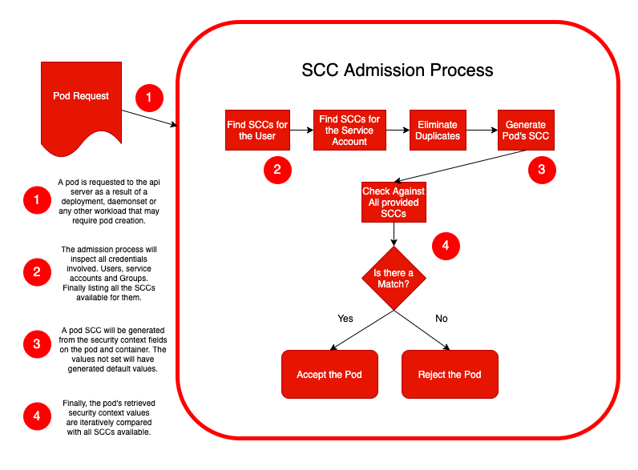

## 前言:

在OpenShift（后文简称OCP）中, 很早就一个概念：Security Context Constraints, 简称SCC, 即安全上下文约束。 K8S的Pod安全策略和OCP中的SCC有一定继承(现有OCP的SCC后有K8S的pod安全策略)。 Security Context Constraints 是 OpenShift 提供的工具, 用于控制平台上允许为每个 pod 请求的权限类型。
为了更好地理解K8S的容器安全策略,并且控制篇幅,我们在本篇中先介绍OCP的SCC。

`Security Context Constraints`是OpenShift提供的工具,用于控制平台上允许每个Pod请求的特权。 OpenShift带有8个预定义的`Security Context Constraints`,
您可以使用oc get scc命令列出这些约束。

| SCC              | 描述                                                                                                                  | 说明                                                                                                                                 |
|------------------|---------------------------------------------------------------------------------------------------------------------|------------------------------------------------------------------------------------------------------------------------------------|
| restricted       | 受限拒绝访问所有主机功能,并要求使用分配给命名空间的 UID 和 SELinux 上下文运行 pod。这是最严格的 SCC,默认情况下用于经过身份验证的用户                                      | 换句话说,这是最安全的。<br/>我们在这篇博文中进一步详细解释。                                                                                                  |
| nonroot          | nonroot 提供受限 SCC 的所有功能,但允许用户使用任何非 root UID 运行。用户必须指定 UID 或必须在容器运行时的清单中指定。                                           | 需要具有相同其他受限 SCC 安全功能的可预测非根 UID 的应用程序可以使用此 SCC,<br/>只要它们在其清单中通知 UID。                                                                 |
| anyuid           | anyuid 提供受限 SCC 的所有功能,但允许用户使用任何 UID 和任何 GID 运行。                                                                     | 在 kubernetes 和 OpenShift 等平台中,这相当于在容器内部和外部允许 UID 0 或 root 用户。这将在进一步的博客文章中讨论。SELinux 在添加保护层方面发挥着重要作用, 使用 seccomp 过滤不需要的系统调用也是一个好主意。 |
| hostmount-anyuid | hostmount-anyuid 提供受限 SCC 的所有功能,但允许主机挂载和 pod 的任何 UID。这主要由持久卷回收器使用。警告：此 SCC 允许主机文件系统作为任何 UID 访问,包括 UID 0。请谨慎授予。      | 与 anyuid 相同的警告,但在这里它更进一步,还允许安装主机卷。请注意,描述中提到的卷回收器是受信任的工作负载和必不可少的基础设施部分。                                                             |
| hostnetwork      | hostnetwork 允许使用主机网络和主机端口,但仍需要使用分配给命名空间的 UID 和 SELinux 上下文运行 pod                                                    | 在这里 pod/container 将能够直接“查看和使用”主机网络堆栈。非零 UID 和预先分配的 SELinux 上下文将有助于放置另一层安全性。                                                        |
| node-exporter    | node-exporter scc 用于 Prometheus 节点导出器                                                                               | `node-exporter`	是为 Prometheus 设计的,用于从集群中检索指标。它允许访问主机网络、主机PIDS 和主机卷,但不允许访问主机IPC。也允许anyuid。不被其他应用程序使用。                               |
| hostaccess       | hostaccess 允许访问所有主机命名空间,但仍需要使用分配给命名空间的 UID 和 SELinux 上下文运行 pod。警告：此 SCC 允许主机访问命名空间、文件系统和 PDS。它应该只由受信任的 pod 使用。谨慎授予。 | 主机命名空间,在描述中,意味着在 pod 或容器命名空间之外,或者,我们可以称之为节点或根 Linux 命名空间。确实,限制 UID 和使用 SELinux 会放置一层安全保护节点。但是,它仍然是一个非常轻松的 SCC,只应由绝对必要的受信任工作负载使用。   |
| Privileged       | 特权允许访问所有特权和主机功能,并能够以任何用户、任何组、任何 fsGroup 和任何 SELinux 上下文运行。警告：这是最宽松的 SCC,应仅用于集群管理。谨慎授予。                              | 这个 scc 允许 pod/容器控制主机/工作节点甚至其他容器中的所有内容。这是最特权和最宽松的 SCC 政策。只有受信任的工作负载才应该使用它,并且讨论是否应该在生产中使用它是有效的。特权 Pod 可以完全控制主机。                      |

默认情况下,在 OpenShift 中,所有 pod 和容器都将使用受限 SCC。
因此,它们将在请求时在 API 服务器中进行检查。
我们将更深入地讨论其中一些 SCC,并探讨如果不使用受限制的 SCC,我们应该牢记的一些安全注意事项。

但是为了授予额外的权限,除了通过受限 SCC 获得的权限之外,我们需要使用不同的 SCC。
这可以是列出的预定义 SCC 之一或自定义构建的 SCC。
为此,我们授予用户、服务帐户或组使用指定 SCC 的权限。

首次向 API 服务器请求 Pod 时,授权 Pod 的凭据将是请求它的用户帐户。
之后,pod 本身将在其服务账户下运行。
如果我们没有为 pod 指定服务账户,它会自动分配在它运行的命名空间上可用的默认服务帐户。
但是每个 pod 都将在一个服务账户下运行。
因此,基于用户、服务账户和/或服务账户所属的组,负责检查所请求权限的准入过程将找到可用的 SCC 集,
并验证所请求的资源安全上下文和约束。如果匹配,则接受 pod,否则拒绝。



## 试一试

我们使用oc 来试一试如何使用scc来管理ocp。

`Security Context Constraints`是与其他任何对象一样的OpenShift对象。
因此, 与oc命令一起使用的经典动词也可以与SCC一起使用。
描述,列出,创建,删除和编辑等任务使用与其他命令相同的命令语法。
不过,您需要以管理员权限登录才能更改或删除SCC。


我们如何通过oc来管理scc？我们可以通过`oc adm policy`来尝试。

```bash
$ oc adm policy

Manage policy on pods and containers:
  add-scc-to-user                 Add users or serviceaccount to a security context constraint
  add-scc-to-group                Add groups to a security context constraint
  remove-scc-from-user            Remove user from scc
  remove-scc-from-group           Remove group from scc

Assign roles to users and groups:
  add-role-to-user                Add a role to users or serviceaccounts for the current project
  add-role-to-group               Add a role to groups for the current project
  remove-role-from-user           Remove a role from users for the current project
  remove-role-from-group          Remove a role from groups for the current project

Assign cluster roles to users and groups:
  add-cluster-role-to-user        Add a role to users for all projects in the cluster
  add-cluster-role-to-group       Add a role to groups for all projects in the cluster
  remove-cluster-role-from-user   Remove a role from users for all projects in the cluster
  remove-cluster-role-from-group  Remove a role from groups for all projects in the cluster

```

创建一个debug容器, 我们进入容器后我们查看当前容器的uid为`1000770000`, 且没有任何写入的权限。

```bash
$ oc create deployment debug --image=clarechu/debug:v1.0.0

$ oc get po

NAME                     READY   STATUS    RESTARTS   AGE
debug-66f5d94894-hf6pm   1/1     Running   0          60s

$ oc exec -it debug-66f5d94894-hf6pm bash
kubectl exec [POD] [COMMAND] is DEPRECATED and will be removed in a future version. Use kubectl exec [POD] -- [COMMAND] instead.


bash-4.4$ ls
bin    dev    etc    home   lib    media  mnt    opt    proc   root   run    sbin   srv    sys    tmp    usr    var
bash-4.4$ whoami
1000770000
bash-4.4$ mkdir -p a
mkdir: can't create directory 'a': Permission denied

```

查看pod 的scc 权限, 可以看到最后的scc权限为最严格的`restricted`.看上去ocp 的scc工作的非常正常, 接下来我们创建service-acount,使当前容器使用
这个sa。

```yaml
$ oc get po debug-66f5d94894-hf6pm -o yaml

apiVersion: v1
kind: Pod
metadata:
  annotations:
    k8s.v1.cni.cncf.io/network-status: |-
      [{
          "name": "",
          "interface": "eth0",
          "ips": [
              "10.130.2.48"
          ],
          "default": true,
          "dns": {}
      }]
    k8s.v1.cni.cncf.io/networks-status: |-
      [{
          "name": "",
          "interface": "eth0",
          "ips": [
              "10.130.2.48"
          ],
          "default": true,
          "dns": {}
      }]
    openshift.io/scc: restricted
...
```

创建sa, 在k8s中在创建namespace的时候默认会创建一个default 的service-account, 那么在当前
namespace中的pod会默认绑定这个默认的default的service-account。以下就不演示这种场景.

```bash
# 创建sa

$ oc create sa demo-sa
serviceaccount/demo-sa created

$ oc get sa
demo-sa    2         4s

# 将pod 绑定到demo-sa这个sa中

$ oc edit deploy debug
...
spec:
  template:
    spec:
      serviceAccount: demo-sa
      serviceAccountName: demo-sa
...      
```


要使用 oc 命令行向用户授予或绑定 SCC,我们有以下命令：

```bash
oc adm policy add-scc-to-user <scc-name-here> user-name


# 要使用 oc 命令行界面将 SCC 授予或绑定到服务账户,我们使用参数 -z：
oc adm policy add-scc-to-user <scc-name-here> -z <service-account-name>

# 要删除这些 SCC,我们使用相同的过程,但使用 remove-scc-from-user：
oc adm policy remove-scc-from-user <scc-name-here> 用户名
oc adm policy remove-scc-from-user <scc-name-here> -z <service-account-name>

# 对于组,过程是相似的：
oc adm policy add-scc-to-group <scc-name-here> <group-name> oc adm policy remove-scc-from-group <scc-name-here> <group-name>

```

接下来我们给demo-sa 权限赋予`nonroot` 权限, 看看会发生什么？

```bash
$ oc adm policy add-scc-to-user nonroot system:serviceaccount:demo:demo-sa

$ oc get po -o yaml

...
    annotations:
      k8s.v1.cni.cncf.io/network-status: |-
        [{
            "name": "",
            "interface": "eth0",
            "ips": [
                "10.130.2.63"
            ],
            "default": true,
            "dns": {}
        }]
      k8s.v1.cni.cncf.io/networks-status: |-
        [{
            "name": "",
            "interface": "eth0",
            "ips": [
                "10.130.2.63"
            ],
            "default": true,
            "dns": {}
        }]
      openshift.io/scc: nonroot
...


...
    securityContext:
      fsGroup: 2000
      runAsGroup: 3000
      runAsUser: 1000 
...

```

以上例子我们可以看出我们设置scc已经生效了, 在pod的annotations中我们已经发现了`openshift.io/scc: nonroot`
当我们在deploy中指定user 和group 时, 我们也可以看到pod中的user 和group 确实是我们指定的ID, 现在我们
指定 uid为0的情况, 看看会发生什么？

```yaml
$ oc edit deploy debug


    securityContext:
      runAsGroup: 0
      runAsUser: 0 
```


我们发现pod并没有触发更新, 我们在查询rs的时候我们发现了异常我们来看看是什么问题？

```bash
$ oc get rs

NAME               DESIRED   CURRENT   READY   AGE
debug-559bfb4fc8   1         0         0       75s
debug-9fbc4c745    1         1         1       27m


$  oc describe rs debug-559bfb4fc8

...
Events:
  Type     Reason        Age                   From                   Message
  ----     ------        ----                  ----                   -------
  Warning  FailedCreate  42s (x16 over 3m27s)  replicaset-controller  Error creating: pods "debug-559bfb4fc8-" is forbidden: unable to validate against any security context constraint: [spec.containers[0].securityContext.runAsUser: Invalid value: 0: must be in the ranges: [1000770000, 1000779999] spec.containers[0].securityContext.runAsUser: Invalid value: 0: running with the root UID is forbidden]
  
  
```

我们可以看到以上出现`securityContext.runAsUser: Invalid value: 0: running with the root UID is forbidden`
uid不能为0 的情况, 看起来很正常。

查询一下我们刚刚添加的scc, 可以看到我们刚刚添加的scc。

```bash
oc adm policy who-can use scc nonroot


resourceaccessreviewresponse.authorization.openshift.io/<unknown>

Namespace: demo
Verb:      use
Resource:  securitycontextconstraints.security.openshift.io

Users:  system:admin
        ...
        system:serviceaccount:demo:demo-sa
        ...
Groups: system:cluster-admins
        system:masters
```

接下来我们来试试 使用挂载`hostmount`, 下面例子显示`spec.volumes[0]: 
Invalid value: "hostPath": hostPath volumes are not allowed to be used 
spec.containers[0].securityContext.runAsUser`
所以我们需要`hostmount-anyuid`才可以。

```bash
$ oc edit deploy debug

spec:
  template:
    spec:
      containers:
      - image: clarechu/debug:v1.0.0
        imagePullPolicy: IfNotPresent
        name: debug
        resources: {}
        terminationMessagePath: /dev/termination-log
        terminationMessagePolicy: File
        volumeMounts:
        - mountPath: /usr/share/nginx
          name: demo
      dnsPolicy: ClusterFirst
      restartPolicy: Always
      schedulerName: default-scheduler
      securityContext:
        runAsGroup: 0
        runAsUser: 0
      serviceAccount: demo-sa
      serviceAccountName: demo-sa
      terminationGracePeriodSeconds: 30
      volumes:
      - name: demo
        hostPath:
          path: /data
          type: Directory
          
          
Events:
  Type     Reason        Age                From                   Message
  ----     ------        ----               ----                   -------
  Warning  FailedCreate  1s (x13 over 22s)  replicaset-controller  Error creating: pods "debug-768575dd8d-" is forbidden: unable to validate against any security context constraint: [spec.volumes[0]: Invalid value: "hostPath": hostPath volumes are not allowed to be used spec.volumes[0]: Invalid value: "hostPath": hostPath volumes are not allowed to be used spec.containers[0].securityContext.runAsUser: Invalid value: 0: must be in the ranges: [1000770000, 1000779999] spec.volumes[0]: Invalid value: "hostPath": hostPath volumes are not allowed to be used spec.containers[0].securityContext.runAsUser: Invalid value: 0: running with the root UID is forbidden]          
          
```

### 自定义scc

例如 使用 hostPath 卷插件

要放宽集群中的安全性，以便允许 Pod 使用 hostPath卷插件而不授予每个人访问更高特权的 SCC（例如privileged、hostaccess或hostmount-anyuid ），请执行以下操作：

创建一个新 SCC `hostpath`

例如

```bash
oc apply -f -<<EOF
kind: SecurityContextConstraints
apiVersion: v1
metadata:
  name: hostpath
allowPrivilegedContainer: true
runAsUser:
  type: RunAsAny
seLinuxContext:
  type: RunAsAny
fsGroup:
  type: RunAsAny
supplementalGroups:
  type: RunAsAny
users:
- my-admin-user
groups:
- my-admin-group
EOF
```


为新的 SCC设置allowHostDirVolumePlugin参数true为：

```bash
$ oc patch scc hostpath -p '{"allowHostDirVolumePlugin": true}'
```
向所有用户授予对此 SCC 的访问权限：

```bash
$ oc adm policy add-scc-to-group hostpath system:authenticated
```
现在，所有请求`hostPath`卷的 Pod都被`hostpath`SCC接纳 。


### 受限 SCC：最安全的标准选择

当创建 pod 时没有明确使用容器规范下的 PodSecurityContext 字段或 SecurityContext 字段,它将默认使用 Restricted SCC。我们来分析一下是什么意思。

以下是受限 SCC 的主要功能说明：

* 确保 pod 不能以特权方式运行。
特权进程是在主机上以 ID 为 0 的 root 或超级用户帐户运行的进程。在这种情况下,特权容器在容器命名空间内外都拥有 root 权限,并且如果所有功能都可用并且没有其他机制（如 SELinux 策略）到位,则可以在主机上执行任何操作。受限的 SCC 会阻止该请求。如果它带有 Privileged = true ,它将被准入过程阻止。

* 确保 pod 无法挂载主机目录卷。
它不允许启用主机目录卷插件并且未列出主机路径卷类型。将这种特权授予 Pod 可能会为试图写入主机文件系统上的禁止路径的漏洞打开大门。

```bash
$ oc get scc restricted -o yaml


...
allowHostDirVolumePlugin: false
...
volumes:
- configMap
- downwardAPI
- emptyDir
- persistentVolumeClaim
- projected
- secret
...
```

  * 要求 Pod 在预先分配的 UID 范围内以用户身份运行。
  当我们谈论容器时,我们有一些警告要在这里探讨,因为容器是有命名空间的。这可能意味着,如果一个特定的容器正在使用我们所说的用户命名空间和 UID 映射,我们最终可能会在容器内部和容器外部为同一进程拥有不同的用户。这是一个复杂的方案,它根据可用的命名空间来改变进程在文件系统中的任何类型的 Linux 构造中查看其特权的方式。在 OpenShift 中,在撰写本文时,这些 UID 在容器内外是相同的,这意味着如果 UID 为 0,pod 将是主机上的 root。CRIO,运行时引擎已经可以进行 UID 映射,但是底层 Kubernetes 平台尚未为此做好准备。这超出了这里的范围（我们可能会在以后的文章中对此进行探讨）,但我认为在考虑 UID 时要牢记这一点很重要。有了受限的 SCC,Pod UID 将被限制在一个预先分配的 UID 范围内,以防止任何可能导致冒充或非法特权升级的操纵。

  * 要求 pod 使用预先分配的 MCS 标签运行。
MCS 标签代表多类别安全标签,它是对 SELinux 的增强,允许用户使用类别标记文件。SELinux 在 OpenShift 节点中默认启用,受限 SCC 将使用该资源进一步限制保护主机文件系统的 Pod 访问。

  * 允许 pod 使用任何 FSGroup。
FSGroup 是一个特殊的补充组,可以应用于 pod 中的所有容器,以使它们能够拥有主机系统上可用的某些特定卷。通过设置这个组,kubelet 能够代表 pod 更改该卷的权限。从而以更安全的方式提供一些灵活性。

  * 允许 Pod 使用任何补充组。
这些是额外的 Linux 组,也可以添加到每个容器中的第一个进程,授予该进程一些较低权限的用户权限。在这里,它也增加了一些灵活性,但添加了补充组作为控制功能。

  * 不使用受限 SCC 时的安全注意事项
一般而言,如果不使用受限 SCC,您可能已授予 Pod 权限,该权限可以部分影响主机、其他 Pod 或容器,甚至可以在主机上获得完全 root 访问权限。例如,当使用 anyuid SCC 时,让 Pod 在任何用户 ID 下运行,允许使用 hostaccess SCC 的大多数主机功能,允许 AllowCapabilties 字段的额外功能或授予具有特权的 SCC 的完全 root 权限,可能会发生这种情况。

一般而言,我们可以说：永远不要以 UID 0 或 root 身份运行您的 pod。
如果您需要针对最低权限的特定功能拍摄并尽最大努力将 SELinux 策略与 Seccomp 过滤和/或可能的 
AppArmor 配置文件结合使用。
