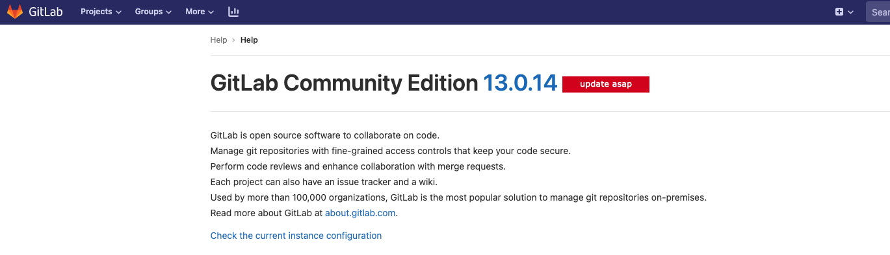

由于我们公司的gitlab 还是n年之前的gitlab, 在升级的时候遇到很多坑, 把遇到的问题记录下来。

安全起见,旧服务器升级Gitlab前,建议先备份数据(虽然是老版本的,但总比丢失了的好)。

## 查询版本及备份

```bash
# 查看gitlab版本:

cat /opt/gitlab/embedded/service/gitlab-rails/VERSION 

# 备份10.8.7版本数据

gitlab-rake gitlab:backup:create RAILS_ENV=production
# 备份后的文件一般是位于/var/opt/gitlab/backups下, 
# 自动生成文件名文件名如 uuid_data_version_gitlab_backup.tar
# 1639718728_2021_12_17_10.8.7_gitlab_backup.tar

```

## 升级

gitlab 在升级的时候有严格的要求, 不能跨版本升级 所以我们在升级的时候必须按照gitlab 推荐的版本来升级。

以下示例假设升级时停机是可以接受的。如果您不想停机,请阅读如何零停机升级。

找到您的版本在下面的升级路径中的位置,并相应地升级 GitLab,同时参考 版本特定的升级说明：

8.11.Z-> 8.12.0-> 8.17.7-> 9.5.10-> 10.8.7-> 11.11.8-> 12.0.12-> 12.1.17-> 12.10.14-> 13.0.14-> 13.1.11-> 13.8.8-> 13.12.15->最新14.0.Z->最新14.1.Z->最新14.Y.Z

具体升级路线可以查看gitlab的 [官方文档](https://docs.gitlab.com/ee/update/index.html#upgrade-paths) 。


因为我们当前的版本为`10.8.7`
gitlab官方所有的[rpm包](https://ftp.sjtu.edu.cn/sites/gitlab-ce/yum/el7/) 按照以上的升级顺序来升级我们的gitlab

所以我们可以按照应该升级到`11.11.8`

```bash
# 下载 11.11.8 版本的gitlab

wget https://ftp.sjtu.edu.cn/sites/gitlab-ce/yum/el7/gitlab-ce-11.11.8-ce.0.el7.x86_64.rpm

# 如果当前机器没有安装gitlab

rpm -ivh gitlab-ce-11.11.8-ce.0.el7.x86_64.rpm

# 如果当前机器安装老版本的gitlab 我们需要升级我们最新的gitlab

rpm -Uih gitlab-ce-11.11.8-ce.0.el7.x86_64.rpm


Running handlers:
Running handlers complete
Chef Client finished, 74/805 resources updated in 02 minutes 47 seconds
gitlab Reconfigured!
Restarting previously running GitLab services
ok: run: alertmanager: (pid 22678) 1s
ok: run: gitaly: (pid 20713) 494s
ok: run: gitlab-exporter: (pid 22672) 1s
ok: run: gitlab-workhorse: (pid 22654) 2s
ok: run: grafana: (pid 22699) 0s
ok: run: logrotate: (pid 22711) 1s
ok: run: nginx: (pid 22721) 0s
ok: run: node-exporter: (pid 22736) 1s
ok: run: postgres-exporter: (pid 22747) 0s
ok: run: postgresql: (pid 20801) 492s
ok: run: prometheus: (pid 22755) 1s
ok: run: redis: (pid 22341) 159s
ok: run: redis-exporter: (pid 22764) 0s
ok: run: sidekiq: (pid 22773) 0s

     _______ __  __          __
    / ____(_) /_/ /   ____ _/ /_
   / / __/ / __/ /   / __ `/ __ \
  / /_/ / / /_/ /___/ /_/ / /_/ /
  \____/_/\__/_____/\__,_/_.___/


Upgrade complete! If your GitLab server is misbehaving try running
  sudo gitlab-ctl restart
before anything else.
If you need to roll back to the previous version you can use the database
backup made during the upgrade (scroll up for the filename).

```


升级到11.11.8后重新初始化一下配置并重启gitlab

```bash
gitlab-ctl reconfigure
gitlab-ctl restart
```

然后我们访问我们最新的gitlab页面看看是否正常, 查看版本完美升级




## 数据迁移


新的服务器上安装最新(11.4.5)版本的gitlab,CentOS7安装请参考。

```bash
#把对应版本的数据从旧服务器上拷贝到新服务器的gitlab备份目录里
#新服务器执行恢复命令
chown -R git.git /var/opt/gitlab/backups/
chmod +x /var/opt/gitlab/backups/

gitlab-rake gitlab:backup:restore RAILS_ENV=production BACKUP=1639718728_2021_12_17_10.8.7

# 注意：这里没有后面的_gitlab_backup.tar名字
# 一路yes,恢复是会先删除新服务器上所有gitlab数据的。

# 在还原备份文件的时候遇到了权限的问题

chown git:git /var/opt/gitlab/backups/
chmod +x /var/opt/gitlab/backups/
```

### 更改gitlab的存储路径

gitlab 的配置文件在`/etc/gitlab/gitlab.rb`

```bash

vim /etc/gitlab/gitlab.rb

# 备份 gitlab 的文件路径 
# gitlab_rails['manage_backup_path'] = true
gitlab_rails['backup_path'] = "/archive/gitlab/backups"

# gitlab 默认的存储路径 默认存放在 /var/opt/gitlab/git-data 下

git_data_dirs({"default" => "/var/opt/gitlab/git-data"})

# 修改为:

git_data_dirs({
  "default" => { "path" => "/var/opt/gitlab/git-data" },
  "alternative" => { "path" => "/mnt/nas/git-data" }
})

# 更新配置 并重启应用

gitlab-ctl reconfigure

gitlab-ctl restart

```


## 同步gitlab 数据的路径

```bash
rsync -av /archive/new/git-data /var/opt/gitlab/git-data # 目标路径

# 同步完成后 更换权限

chown git:git /archive/new/git-data

chmod 775 /archive/new/git-data

```


## 修改gitlab的访问域名

```bash
# 访问的地址
external_url 'http://git.xx.com'

## git clone 使用的ssh地址
gitlab_rails['gitlab_ssh_host'] = 'git.xx.com'
```


## gitlab 启动https

```bash
 
 # http >> https
 external_url 'https://ip:port'
 
 #修改nginx配置 
 nginx['redirect_http_to_https'] =true
 
 nginx['ssl_certificate'] = "/etc/gitlab/ssl/server.crt"
 nginx['ssl_certificate_key'] = "/etc/gitlab/ssl/server.key"
```