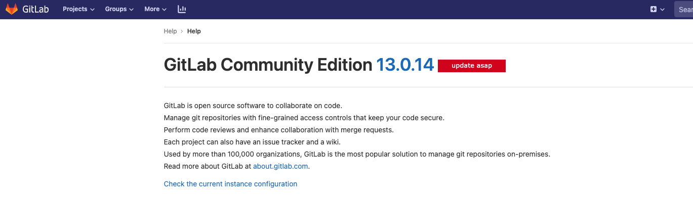

## namespace 的概念

namespace 是 Linux 内核用来隔离内核资源的方式。
通过 namespace 可以让一些进程只能看到与自己相关的一部分资源，而另外一些进程也只能看到与它们自己相关的资源，这两拨进程根本就感觉不到对方的存在。
具体的实现方式是把一个或多个进程的相关资源指定在同一个 namespace 中。


## namespace 的比喻

对于某些人来说，namespace这个定义有很多不能让人理解的地方，因此以下这种比方可能会对你有所帮助。
考虑一下我的公寓楼。从技术上讲，这是两座不同的建筑，都有自己的入口。
但是，停车场，健身房，游泳池和公共休息室是共享的。这些建筑物有自己的名称，城市广场和城市广场2。
他们有自己的街道地址，楼层和电梯。然而，它们依附于相同的物理复合体。

物理复合体与计算机的想法相同。两个名称空间（或多个名称空间）可以驻留在同一台物理计算机上，
并且与公寓楼一样，名称空间可以共享对某些资源的访问权限，也可以具有独占访问权限。

今天，有七种常见的名称空间被广泛使用。
以公寓为指导，让我们逐步总结每种类型的功能。
下面是每种名称空间类型的简要概述。在后续文章中，我们将通过示例展示每个命名空间的工作方式。

## namespace 的类型有哪些

* 进程隔离（PID名称空间）
* 网络接口（网络名称空间）


* Unix时间共享系统（uts名称空间）
* 用户名称空间
* 挂载（mnt名称空间）
* 进程间通信（IPC）
* CGroups


## linux 网络命名空间

1. ip netns add xx 建立一個 namespace

```bash
$ ip netns add net1
$ ip netns ls
net1
```

2. ip netns exec <netns namespace> <BASH SHELL> 在新 namespace net1 中執行 BASH SHELL 命令

```bash
$ ip netns exec net1 bash

# exit 退出容器空间

$ exit
```




每個 namespace 在建立的時候會自動建立一個迴環介面 lo ，預設不啟用，可以通過  啟用。

```bash
$ ip link set lo up
```

network namespace 之間的通訊
新建立的 namespace 預設不能和主機網路，以及其他 namespace 通訊。

可以使用 Linux 提供的 veth pair 來完成通訊。下面顯示兩個 namespace 之间的网络拓扑图：


3.1 ip link add type veth 建立 veth pair

```bash
# 查看veth

$ ip link

1: lo: <LOOPBACK,UP,LOWER_UP> mtu 65536 qdisc noqueue state UNKNOWN mode DEFAULT group default qlen 1000
    link/loopback 00:00:00:00:00:00 brd 00:00:00:00:00:00
2: ens192: <BROADCAST,MULTICAST,UP,LOWER_UP> mtu 1500 qdisc mq state UP mode DEFAULT group default qlen 1000
    link/ether 00:50:56:a9:e9:17 brd ff:ff:ff:ff:ff:ff
3: docker0: <NO-CARRIER,BROADCAST,MULTICAST,UP> mtu 1500 qdisc noqueue state DOWN mode DEFAULT group default
    link/ether 02:42:8b:f3:61:ac brd ff:ff:ff:ff:ff:ff
    
    
```

添加 link veth pair
```bash
# 添加 veth pair

$ ip link add type veth

# 使用命令 ip link add xxx type veth peer name yyy 指定 veth pair 的名字。

$ ip link add veth1 type veth peer name veth2

$ ip link

1: lo: <LOOPBACK,UP,LOWER_UP> mtu 65536 qdisc noqueue state UNKNOWN mode DEFAULT group default qlen 1000
    link/loopback 00:00:00:00:00:00 brd 00:00:00:00:00:00
2: ens192: <BROADCAST,MULTICAST,UP,LOWER_UP> mtu 1500 qdisc mq state UP mode DEFAULT group default qlen 1000
    link/ether 00:50:56:a9:e9:17 brd ff:ff:ff:ff:ff:ff
3: docker0: <NO-CARRIER,BROADCAST,MULTICAST,UP> mtu 1500 qdisc noqueue state DOWN mode DEFAULT group default
    link/ether 02:42:8b:f3:61:ac brd ff:ff:ff:ff:ff:ff
8: veth2@veth1: <BROADCAST,MULTICAST,M-DOWN> mtu 1500 qdisc noop state DOWN mode DEFAULT group default qlen 1000
    link/ether 6e:86:2f:10:5c:50 brd ff:ff:ff:ff:ff:ff
9: veth1@veth2: <BROADCAST,MULTICAST,M-DOWN> mtu 1500 qdisc noop state DOWN mode DEFAULT group default qlen 1000
    link/ether 0a:b8:54:5b:9f:7d brd ff:ff:ff:ff:ff:ff
    
veth pair 因为是成对出现的 所以 有8和9 

分别是`veth1@veth2` -- `veth2@veth1` 
```

3.2 ip link set xx netns yy 將 veth xx 加入到 namespace yy 中

```bash
$ ip link set veth1 netns net1

$ ip link set veth2 netns net2

```


加入到namespace 有以下现象

```bash
$ ip link
1: lo: <LOOPBACK,UP,LOWER_UP> mtu 65536 qdisc noqueue state UNKNOWN mode DEFAULT group default qlen 1000
    link/loopback 00:00:00:00:00:00 brd 00:00:00:00:00:00
2: ens192: <BROADCAST,MULTICAST,UP,LOWER_UP> mtu 1500 qdisc mq state UP mode DEFAULT group default qlen 1000
    link/ether 00:50:56:a9:e9:17 brd ff:ff:ff:ff:ff:ff
3: docker0: <NO-CARRIER,BROADCAST,MULTICAST,UP> mtu 1500 qdisc noqueue state DOWN mode DEFAULT group default
    link/ether 02:42:8b:f3:61:ac brd ff:ff:ff:ff:ff:ff
8: veth2@if9: <BROADCAST,MULTICAST> mtu 1500 qdisc noop state DOWN mode DEFAULT group default qlen 1000
    link/ether 6e:86:2f:10:5c:50 brd ff:ff:ff:ff:ff:ff link-netnsid 0
    
$ ip link set veth2 netns net2

$ ip link

1: lo: <LOOPBACK,UP,LOWER_UP> mtu 65536 qdisc noqueue state UNKNOWN mode DEFAULT group default qlen 1000
    link/loopback 00:00:00:00:00:00 brd 00:00:00:00:00:00
2: ens192: <BROADCAST,MULTICAST,UP,LOWER_UP> mtu 1500 qdisc mq state UP mode DEFAULT group default qlen 1000
    link/ether 00:50:56:a9:e9:17 brd ff:ff:ff:ff:ff:ff
3: docker0: <NO-CARRIER,BROADCAST,MULTICAST,UP> mtu 1500 qdisc noqueue state DOWN mode DEFAULT group default
    link/ether 02:42:8b:f3:61:ac brd ff:ff:ff:ff:ff:ff
```

3.3 給 veth pair 配上 ip 地址

```bash
# 给net0 namespace 空间 veth0 up
$ ip netns exec net1 ip link set veth1 up

$ ip addr add 10.1.1.1/24 dev veth1
# veth0 up 设置ip 启动起来

$ ip route
10.1.1.0/24 dev veth1 proto kernel scope link src 10.1.1.1

# 给net2 namespace 空间 veth2 up

$ ip addr add 10.1.1.2/24 dev veth2

```


